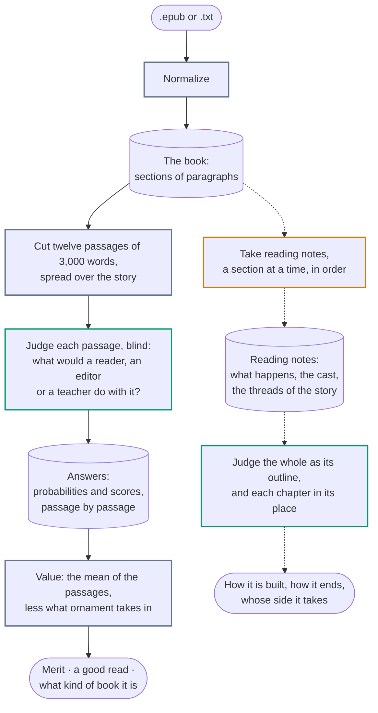
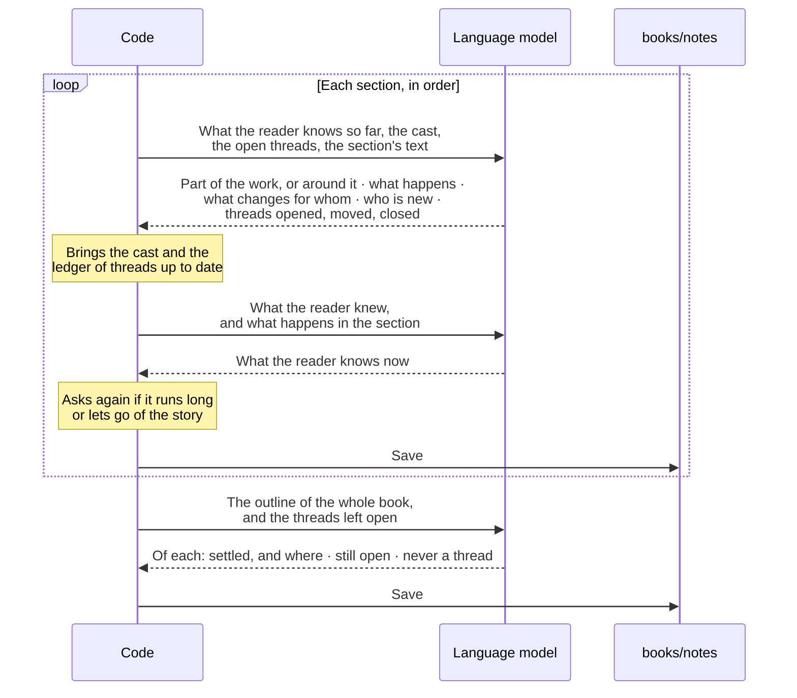

# Books: from a file to a valuation

This is how Salomón values a book. Another kind of work, a record or a film, would get a pipeline of its own.

Jev answers closed questions about what fits in one call, some 32,000 tokens: a chapter, never a book. So a book is judged by passages of it, and what only the whole shows is asked of notes that a language model takes beforehand. Three hands do the work, and each does one thing: code moves things along and does the sums, the language model writes down what happens and judges nothing, and Jev judges and writes nothing.

## The whole way

Grey is code, orange the language model, green Jev. The solid way is what values a book, `npm run judge` and `npm run value`: a quarter of a cent and ten seconds. The dotted one adds to its profile what only the whole book shows, and is run by the scripts of [what only the whole book shows](whole-book.md): some ten cents a book, nearly all of it the notes.

What each step leaves is kept, the book and its notes under `books/` and Jev's answers under `records/`, so a step is paid for once: nothing has to be asked again to weigh the answers another way.

| Step               | By                                                          | From                                                                                        | Leaves                                                                                                                                                                                                                  |
| ------------------ | ----------------------------------------------------------- | ------------------------------------------------------------------------------------------- | ----------------------------------------------------------------------------------------------------------------------------------------------------------------------------------------------------------------------- |
| Normalize          | Code                                                        | An EPUB or a plain text                                                                     | The book's sections, each with its title and its paragraphs as plain text: the paragraph is where a book can be cut                                                                                                     |
| Cut the passages   | Code                                                        | The sections that are the story, as one text                                                | Twelve passages of about 3,000 words, evenly spread from the first to the last, each ending where a paragraph ends                                                                                                      |
| Judge each passage | Jev                                                         | The passage alone, with no title nor author                                                 | Fourteen answers about what a reader, an editor or a teacher would do with it                                                                                                                                           |
| Value              | Code                                                        | The answers of the twelve passages                                                          | Merit and a good read, from 0 to 1; how even the book is; what it reads like and whom it is written for                                                                                                                 |
| Take reading notes | A language model, through OpenRouter: Gemini 3.1 Flash-Lite | The book, a section at a time                                                               | For each section: whether it is part of the work or stands around it, what happens, what changes for whom, the threads it touches, what a reader knows by its end. For the book: its cast and the ledger of its threads |
| Judge the whole    | Jev                                                         | The notes as an outline of the book; each chapter with what the reader knows on reaching it | How far it is one whole, what brings its end about, how far it looks beyond its people, in what share of its chapters both sides have a claim                                                                           |

## Why passages, why twelve, why 3,000 words

Each was tried, on twenty books of known standing, and is written up in [other ways of asking](other-ways.md).

- **Passages and not chapters**, since a chapter is 1,700 words in one book and 11,000 in another, and Jev does not score a chapter as it scores its pieces: what is present it scores as the most of its pieces, what is a share as their mean.
- **Twelve**, since the merit of a book judged whole is known to ±0.01, and twelve passages spread over it order books as the whole does.
- **3,000 words**, since under 2,000 a passage of the better of two books comes out over one of the worse less often, from 2,500 to 4,000 nothing moves, and the questions are paid once a call.
- **What people would do and not what the writing is like**, since asked so Jev orders books of known standing better with half the questions, needs no allowance for the age of the prose, and with one guard is not taken in by ornament.
- **Blind**, since what Jev is told of a text moves what it says of it: a name or a critic's word beside a chapter of Austen took it from 0.95 to 0.53 as finely written.

## Taking the notes

The model is told to go by the text alone, to leave out what it remembers of the book and what it thinks of it, and to write in English whatever the book's language, which is the one Jev reads best. If it gave opinions, Jev would end up judging the model's opinion of the book instead of the book.

Each thing it is asked is one narrow job, with a call of its own. Asked for everything at once, the model takes the notes of the section well and lets the rest go: what the reader knows so far grows past any limit and then shrinks to the last chapter, and threads stay open that the book settled long before.

Sections are read in order because what comes out of each is what the next is read in the light of: what a reader knows so far, with nothing of what comes later in it. That is also what Jev is given with a chapter. It is the one text rewritten at every step, from what it was and what the section adds, and code holds it to its length. The cast and the threads are lists that grow, kept by code, so that what was noted early is not lost by the end; what each section adds to the cast is kept with the section, so that the cast can be had as a reader knew it on reaching any chapter. A section that stands around the work, such as a table of contents or somebody else's preface, leaves what the reader knows as it was, and is not for Jev to judge.

A thread settled without anybody saying so is easy to miss from inside a chapter. Once the book is read, the threads still open are looked at once more with the whole of it in view, as its outline: what a book leaves unanswered should be the book's doing, not the note-taker's.

## What the notes are for

The notes were made to give Jev the view of the whole, and that is what they are used for; they are no part of how a passage is judged, since with what the reader knows so far beside a chapter Jev's answers about the chapter moved by 0.02. Two things are asked with them. The notes of all its sections make an outline of the book that fits in one call, and of that Jev is asked how the book is built and how it ends. And each chapter is sent with what the reader knows on reaching it, to ask what it does to the people of the story: whether someone is torn, and whether both sides of its conflict have a claim on the reader.

Jev does not count and does not follow a long chain of steps. Keeping track is for the notes and for code: which threads were never closed is read off the ledger, and a character's arc is what changed for them, section after section, put in a row. What that tells, and what it does not, is in [what only the whole book shows](whole-book.md): how a book is built and not how well.

## What it costs, and how long it takes

Jev charges for what it reads, $0.042 a million tokens, and nothing for its answers. A language model charges for both, each by its own price, which OpenRouter lists. Normalizing and valuing are code, take under a second and cost nothing.

What each step has taken when it was run, from the [records](../../records/README.md), all on _Treasure Island_, 67,800 words, on 2026-09-19:

| Step                                                    | By                             | Calls | Tokens in | Tokens out | Cost    | Time  |
| ------------------------------------------------------- | ------------------------------ | ----- | --------- | ---------- | ------- | ----- |
| Judge twelve passages of 3,000 words, 14 questions each | Jev, `jev-1.13.0`              | 12    | 61,456    | free       | $0.0026 | 7 s   |
| Take reading notes                                      | `google/gemini-3.1-flash-lite` | 68    | 159,687   | 24,555     | $0.0768 | 2 min |
| Judge the whole as its outline                          | Jev                            | 1     | 9,650     | free       | $0.0004 | 1 s   |
| Judge each chapter in its place, 5 questions each       | Jev                            | 34    | 126,776   | free       | $0.0053 | 15 s  |

The first valuation judged the whole book in pieces of 1,000 words and set twelve of them against a panel of six passages, both ways round: 212 calls and $0.031 for the same book, twelve times as much for an order of books no better.

The model that takes the notes was chosen among nine, each tried on the same book: [who takes the notes](notes-experiments.md) has every run, what it cost and why it was kept or let go. What that showed about cost and time:

- Taking notes is a call after another, each waiting for the one before, so its time is the sum of them all. A model that thinks before it answers takes half a minute to two minutes a section, and one that does not, four seconds.
- What a model thinks is paid for as output: up to 87% of what one of them wrote. It also makes its cost hard to foresee, a single answer running to 24,000 tokens.
- OpenRouter sends the same model to one provider or another, 11 of them in one run. They differ in price, up to five times; in whether the model thinks; and in how closely it follows its instructions. Asking for the cheapest first made the same notes 42% cheaper and better kept to their limits.
- Not only the calls that come back are paid for. A call cut off for taking too long is billed for what the model had written by then, and nothing on this side says how much: of the $0.46 that choosing a model cost, a quarter is in no record. It happens to models that think, on providers that are slow.
- With Jev the questions weigh as much as the text on short passages: each adds some 110 tokens to every call, so a piece of 1,000 words, 1,300 tokens by itself, came to 4,200 with the 29 questions of the first valuation. At 3,000 words and fourteen questions the text is three quarters of the call, which is one reason the passages are of that size.
- Jev is the cheap part: judging a book costs a thirtieth of what taking its notes does. What Jev was tried on before settling the questions, and what that cost, is in [what Jev can tell of a chapter](jev-experiments.md).

## The valuation

Jev is never asked whether a book is good. It is asked narrow things about what people would do with a passage, and a valuation is arithmetic on its answers, by rules that have a hash as the questions have theirs: [src/value.ts](../../src/value.ts).

- **Literary merit** is the mean of nine answers: what a reader would mark to keep, whether every word reads as weighed, what an editor would do, what is remembered a week later, who could have written it, whether a teacher would give it to a class to learn from and as what not to do, whether a reader would come back to it and enjoy it aloud. Six of them are taken in by a passage overdone on purpose; the teacher's two are not. So those six count for less the surer the teacher is that the passage is what not to do, in full up to half sure and for nothing when certain.
- **A good read** is whether a reader would be taken in, go on rather than stop, and not skim.
- **What judges nothing**: the lowest and the highest of its passages, which says how even the book is; what it reads like, a draft or a text with every word weighed; and whom it is written for, children, the widest public, readers in general or those who read for the writing.

There is more than one way to weigh a book, and that is the old argument about what a rating is for: whoever rates a book by its literary merit and whoever rates it by how much they liked it are weighing the same book differently. The answers are kept, so weighing them another way asks Jev nothing. What a merit of 0.79 means, and what it does not, is in [how to read a valuation](reading-a-valuation.md).
