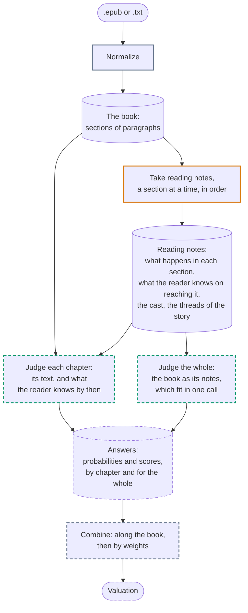
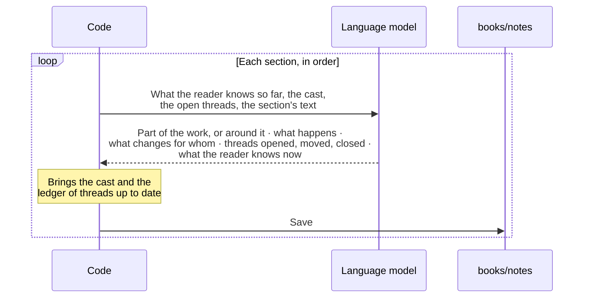
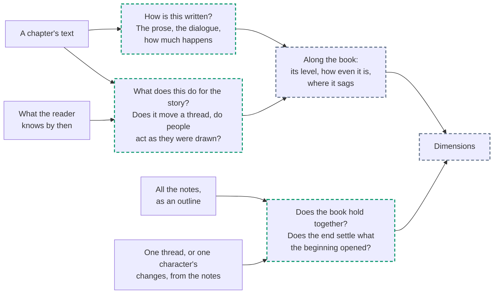
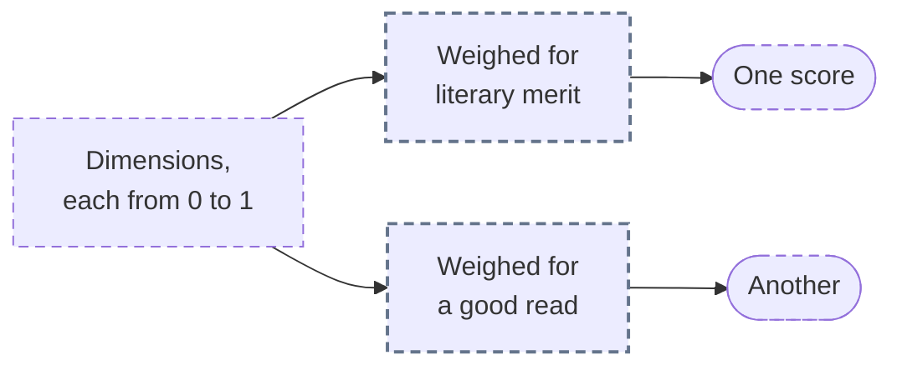

# Books: from a file to a valuation

This is how Salomón values a book. Another kind of work, a record or a film, would get a pipeline of its own.

Jev answers closed questions about what fits in one call, some 32,000 tokens: a chapter, never a book. So a book is judged in pieces, and what holds the pieces together is made beforehand, by a language model that reads the book and takes notes. Three hands do the work, and each does one thing: code moves things along and does the sums, the language model writes down what happens and judges nothing, and Jev judges and writes nothing.

## The whole way

Grey is code, orange the language model, green Jev; what is dashed is not built yet.

What each step leaves is kept under `books/`, so a step is paid for once: the notes do not have to be taken again to ask Jev something else, and nothing has to be asked again to weigh its answers another way.

| Step               | By                                   | From                                                                                       | Leaves                                                                                                                                                                                                                  |
| ------------------ | ------------------------------------ | ------------------------------------------------------------------------------------------ | ----------------------------------------------------------------------------------------------------------------------------------------------------------------------------------------------------------------------- |
| Normalize          | Code                                 | An EPUB or a plain text                                                                    | The book's sections, each with its title and its paragraphs as plain text: the paragraph is where a book can be cut                                                                                                     |
| Take reading notes | A language model, through OpenRouter | The book, a section at a time                                                              | For each section: whether it is part of the work or stands around it, what happens, what changes for whom, the threads it touches, what a reader knows by its end. For the book: its cast and the ledger of its threads |
| Judge each chapter | Jev                                  | A chapter's text, with what the reader knows on reaching it                                | Answers about the chapter: how it is written, and what it does for the story                                                                                                                                            |
| Judge the whole    | Jev                                  | All the notes, as an outline of the book; a thread, or a character's changes, on their own | Answers about the book: whether it holds together                                                                                                                                                                       |
| Combine            | Code                                 | Every answer                                                                               | The valuation                                                                                                                                                                                                           |

## Taking the notes

The model is told to go by the text alone, to leave out what it remembers of the book and what it thinks of it, and to write in English whatever the book's language, which is the one Jev reads best. If it gave opinions, Jev would end up judging the model's opinion of the book instead of the book.

Sections are read in order because what comes out of each is what the next is read in the light of: what a reader knows so far, with nothing of what comes later in it. That is also what Jev is given with a chapter. Only that text is rewritten at every step; the cast and the threads are lists that grow, kept by code, so that what was noted early is not lost by the end. A section that stands around the work, such as a table of contents or somebody else's preface, leaves what the reader knows as it was, and is not for Jev to judge.

## Where the view of the whole comes from

Jev sees a chapter at a time, and a book is more than its chapters one by one. What is true of the whole is reached in three ways.

1. **The sum of the parts.** Jev answers the same questions of every chapter, and code lines the answers up along the book. How well a book is written is how well its chapters are, and how evenly; where it drags is where little happens for long.
2. **A chapter, knowing what came before.** Some questions are about a chapter and cannot be answered from it alone: whether it moves the story on, whether its people act as they were drawn. Jev is given what the reader knows on reaching it. It is kept short, and the questions say which part is being judged, because what stands next to a text rubs off on what Jev says of it.
3. **The book as its notes.** The notes of all its sections make an outline of the book that fits in one call, and of that Jev can be asked what is only true of the whole.

Jev does not count and does not follow a long chain of steps. Keeping track is for the notes and for code: which threads were never closed is read off the ledger, and a character's arc is what changed for them, section after section, put in a row. What Jev gets is a narrow question on a small piece of that: of one thread, whether the way it ends follows from the way it began.

## What it costs, and how long it takes

Jev charges for what it reads, $0.042 a million tokens, and nothing for its answers. A language model charges for both, each by its own price, which OpenRouter lists. Normalizing is code, takes under a second and costs nothing.

What each step has taken when it was run, from the [records](../../records/README.md):

| Step               | Book                 | Words  | By                           | Calls | Tokens in | Tokens out | Cost    | Time        | When       |
| ------------------ | -------------------- | ------ | ---------------------------- | ----- | --------- | ---------- | ------- | ----------- | ---------- |
| Take reading notes | King Solomon's Mines | 81,994 | `deepseek/deepseek-v4-flash` | 21    | 143,304   | 36,138     | $0.0086 | 13 min 32 s | 2026-09-19 |
| Judge each chapter | not run yet          |        | Jev                          |       |           |            |         |             |            |
| Judge the whole    | not run yet          |        | Jev                          |       |           |            |         |             |            |

- Taking notes is a call after another, each waiting for the one before, so its time is the sum of them all: some 40 seconds a section.
- Of what the model wrote, 30% was thinking before the answer, which is paid for as output.
- OpenRouter sends the same model to one provider or another in the course of a run. They differ in price, in whether the model thinks, and in how closely it follows its instructions.
- A call to Jev with one sentence and two questions took 347 tokens: what goes around the text counts, and an estimate made from the text alone falls short.

## The valuation

Jev is never asked whether a book is good. It is asked many narrow things, which add up to dimensions, and a valuation is those dimensions weighed. There is more than one way to weigh them, and that is the old argument about what a rating is for: whoever rates a book by its literary merit and whoever rates it by how much they liked it are weighing the same book differently. The dimensions are kept, so weighing them another way asks Jev nothing.

Which questions, which dimensions they add up to and which weights make a valuation anyone would stand by is what the experiment is there to find.
